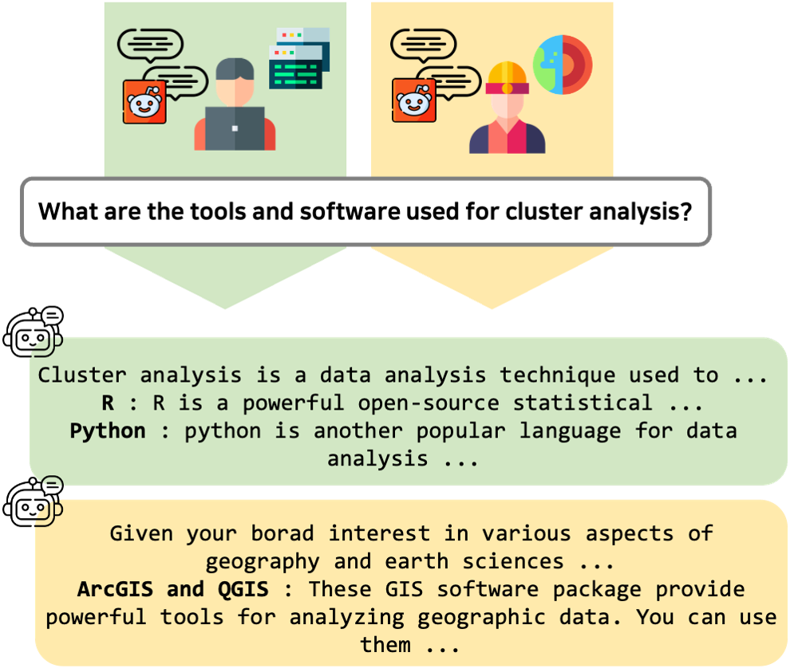

<div align="center">

<h1>PerIR: Personalized Information Retrieval</h1>

**[Junghyun Kim][1], &nbsp; [Suyeon Shin][2], &nbsp; [Moonhoen Lee][3], &nbsp; [Sujin jeon][4], &nbsp; [Jiseong Chung][5]** <br>

</div>


## Overview
A dataset for Personalized Information Retrieval (PerIR).

<br><br>

PerIR aims to deliver responses that are specifically tailored to the user's social media content on platforms like Reddit, in response to a given query. 
The objective is to provide highly relevant and personalized answers that align with the unique characteristics and preferences evident in the user's postings on social media.


Use PerIR
----------------------
Using PerIR is simple:

```shell
git clone https://www.github.com/JHKim-snu/PerIR
```

Simply import `PerIR` from `perir_dataset`

```python
from perir_dataset import PerIR

perir = PerIR('./data/gt.json', './data/reddit_interest.json', "", None, './data/gt2topic.json')
```


Environment Setup
----------------------
Python 3.7+, Anaconda/Miniconda (recommended) <br>

1. Install Anaconda or Miniconda from [here][8].
2. Clone this repository and create an environment:

```shell
git clone https://www.github.com/JHKim-snu/PerIR
conda create -n perir python=3.8
conda activate perir
```

3. Install all dependencies:
```shell
pip install -r requirements.txt
```

If you want to construct your own PerIR data or infer the models, you must need an openai API key. 
Follow the instructions [here](https://platform.openai.com/docs/quickstart?context=python) and save your key in `personal_info/openai_key_{NAME}.txt`

To use Reddit API, follow the instructions [here](https://github.com/reddit-archive/reddit/wiki/OAuth2) and save your information as following in `personal_info/reddit.json`
```python
{
    "client_id":"hLAu4IE_qw8sS1aBUX0Zww",
    "client_secret":"5AxBtnM7BdmxmZ8gu-sKg00gIs34DA",
    "user_agent":"monhoney-agent",
    "username":"monhoney",
    "password":"bi1847!!"
}
```

How to Build PerIR
----------------------
<span style="color:red">You can skip this part if you only want to use the dataset.</span>

First, you need a list of polysemes in a `.tsv` format.
The polyseme we constructed can be found in `./data/polyseme.tsv`.

Then, we crawl the fields and meanings of every polyseme from Wikipedia.
The crawled data is provided in `./data/polyseme_wiki.json`, and can be done by following the script:

```shell
python wiki_crawling.py
```

KKKKKKKKKKKKKKKKKK


Now, you need to match each answers to a subreddit to get an user interest data (reddit posts of a user).

```shell
python subreddit2topic.py
```
This is based on the [reddit API](https://praw.readthedocs.io/en/stable/code_overview/reddit/subreddits.html)


Evaluation
----------------------


This Python script allows you to evaluate text metrics between predicted and ground truth files. It supports various metrics such as BLEU, METEOR, ROUGE, Google BLEU, and BERTScore.

```shell
python eval.py —-metric all ./data/pred.json ./data/gt.json
```

- `pred_filepath`: Path to the file containing predicted text.
- `gt_filepath`: Path to the file containing ground truth text.
- `--metric`: Specify the metric to use for evaluation (default: all). Choose from 'all', 'bertscore', 'bleu', 'meteor', 'rouge', 'google_bleu'.
- `--format`: Supports `.txt` format or `.json` format. For `.txt` format, each line should contain sentences of each samples. `.json` format consists of a list of dictionaries as examplified below:

**for ground truth data**
<pre>
[
    {
    “query”: {Query},
    “polyseme”: {polyseme}, 
    “answers” : {
            {field1}: {answer1},
            {field2}: {answer2},
            ...
        }
    }, 
    ...
]
</pre>

**for prediction data**
<pre>
[
    {
    “query”: {Query},
    “polyseme”: {polyseme}, 
    “answers” : {
            {field1}: [{answer1-1}, {answer1-2}, ...],
            {field2}: [{answer2-1}, {answer2-2}, ...],
            ...
        }
    }, 
    ...
]
</pre>


[1]: https://jhkim-snu.github.io/
[2]: https://github.com/suyeonshin/
[3]: https://github.com/monhoney
[4]: https://github.com/vsujinv
[5]: https://github.com/CHUNG-JiSeong
